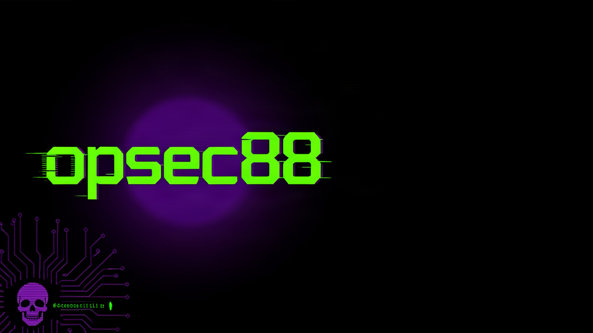

# `opsec88`



```
   ____  ____  _____ ____  ____  ____   __  __ ____
  / _  \/ ___|| ____|  _ \| ___|/ ___| / / / /|  _ \
 | | | | |  _ |  _| | |_) |  _| \___ \| | | || |_) |
 | |_| | |_| || |___|  __/|___| ___) | |_| ||  __/
  \____/\____|_____|_|   |____||____/ \___/ |_|
            diy hardware // pentest fleet // teach not hurt
```

I build **tiny hacker hardware** and the software that drives it — ESP32 / RP2040 / Pi
rigs, RFID + WiFi toys, and one Android app to rule them all. Everything is **built to
teach, not hurt**: authorized labs, your own gear, your own networks.

### The fleet
| Project | Silicon | What it is |
|---------|---------|------------|
| [Evil Dark Pi OS](https://github.com/opsec1288/evil-dark-pi-os) | uConsole CM4 (eMMC) | tiny pentest desktop — drivers + LXQt + tool downloader |
| [DeathStalker](https://github.com/opsec1288/deathstalker) | RPi Zero 2 W + ESP32 | Flipper-class wireless handheld (WiFi/BLE/sub-GHz/BadUSB) |
| Parasite 🔧 | RP2040 Zero + ESP8266 | "Infectious Rubber Ducky" — remote-triggered HID (code dropping tonight) |
| Black Widow 🔧 | NanoPi Neo3 + ESP32-C6 | leave-behind recon "dropbox" (sub-GHz/BLE) (code dropping tonight) |
| [Hive Mind](https://github.com/opsec1288/hive-mind) | Android | one app to drive the whole fleet |
| [Web Flasher](https://github.com/opsec1288/web-flasher) | browser | flash ESP32/ESP8266/RP2040 over USB, no CLI |

### What I mess with
`ESP32 / ESP32-C6` · `RP2040 / Pico` · `ESP8266` · `Bruce firmware` · `Raspberry Pi (Zero 2 W / CM4 / Neo3)`
· `RFID / PN532` · `CC1101 sub-GHz` · `WiFi (802.11) + Bluetooth` · `Python / Bash / CircuitPython`

### Links
[GitHub](https://github.com/opsec1288) · [Evil Dark Pi OS](https://github.com/opsec1288/evil-dark-pi-os)
· [Web Flasher](https://opsec1288.github.io/web-flasher/)

---

> ⚠️ **Built to TEACH, not hurt.** Use only on hardware you own or networks/systems you're
> explicitly authorized to test. The author is not responsible for how you point this stuff.
